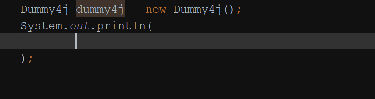

# Dummy4j


[](https://sonarcloud.io/dashboard?id=dummy4j)
[](https://sonarcloud.io/dashboard?id=dummy4j)
[](https://sonarcloud.io/dashboard?id=dummy4j)
[](https://sonarcloud.io/dashboard?id=dummy4j)
[](https://sonarcloud.io/dashboard?id=dummy4j)
[](https://sonarcloud.io/dashboard?id=dummy4j)


[](https://search.maven.org/artifact/dev.codesoapbox/dummy4j)
[](https://javadoc.io/doc/dev.codesoapbox/dummy4j)

Dummy4j is an easy to use dummy data generator library for Java, designed for extensibility.

Dummy4j can be used in all projects using Java 8+.



## Getting started

Add the following dependency to your `pom.xml`:

```xml
<!-- https://mvnrepository.com/artifact/dev.codesoapbox/dummy4j -->
<dependency>
  <groupId>dev.codesoapbox</groupId>
  <artifactId>dummy4j</artifactId>
  <version>0.6.0</version>
</dependency>
```

Now you can start using Dummy4j:
```java
Dummy4j dummy = new Dummy4j();

String randomCountry = dummy.nation().country();
```

The default configuration of Dummy4j uses a file-based definition provider which reads data definitions from `.yml`
files inside the `resources/dummy4j` folder. Additionally, the default locale is `en`.

## Documentation

Reference documentation for Dummy4j is available at:\
https://daniel-frak.github.io/dummy4j

API documentation for Dummy4j is available at:\
https://javadoc.io/doc/dev.codesoapbox/dummy4j

## Motivation

Generating dummy data greatly simplifies development and testing of software.
While many such generators exist, none of those for Java seem to support easy extensibility, which is crucial for
many use cases.

While the ideas behind Dummy4j were first presented as a proposal for [Java Faker](https://github.com/DiUS/java-faker),
it turned out that it would be easier to write an entirely new library.

Dummy4j focuses on ease of use, clean code and effortless extensibility, while still taking inspiration from Ruby's 
[Faker](https://github.com/faker-ruby/faker) gem.

## Why extensibility is important

Not all data is going to be useful to the general public and not all data can be publicly shared due to company
policies. Therefore, it is imperative a dummy data library allows for easy and maintainable extension of its
data definitions.

Furthermore, edge cases may exist where the functionality of the library must be altered. It is easy to imagine
wanting to store data definitions in a central private repository from which the library would load them during
instantiation. The classes themselves must, therefore, be clean, well documented and extensible.

## Out-of-the-box dummies

While you can easily add your own dummy data definitions, the following are available out of the box: 

* [Name](https://javadoc.io/doc/dev.codesoapbox/dummy4j/latest/dev/codesoapbox/dummy4j/dummies/NameDummy.html)
* [Nation](https://javadoc.io/doc/dev.codesoapbox/dummy4j/latest/dev/codesoapbox/dummy4j/dummies/NationDummy.html) *(since 0.2.0)*
* [Address](https://javadoc.io/doc/dev.codesoapbox/dummy4j/latest/dev/codesoapbox/dummy4j/dummies/AddressDummy.html)
* [Lorem](https://javadoc.io/doc/dev.codesoapbox/dummy4j/latest/dev/codesoapbox/dummy4j/dummies/LoremDummy.html)
* [Date and Time](https://javadoc.io/doc/dev.codesoapbox/dummy4j/latest/dev/codesoapbox/dummy4j/dummies/DateAndTimeDummy.html) *(since 0.4.0)*
* [Identifier](https://javadoc.io/doc/dev.codesoapbox/dummy4j/latest/dev/codesoapbox/dummy4j/dummies/IdentifierDummy.html) *(since 0.5.0)*
* [Education](https://javadoc.io/doc/dev.codesoapbox/dummy4j/latest/dev/codesoapbox/dummy4j/dummies/EducationDummy.html) *(since 0.3.0)*
* [Book](https://javadoc.io/doc/dev.codesoapbox/dummy4j/latest/dev/codesoapbox/dummy4j/dummies/BookDummy.html) *(since 0.2.0)*
* [Research Paper](https://javadoc.io/doc/dev.codesoapbox/dummy4j/latest/dev/codesoapbox/dummy4j/dummies/ResearchPaperDummy.html) *(since 0.2.0)*
* [Sci-fi](https://javadoc.io/doc/dev.codesoapbox/dummy4j/latest/dev/codesoapbox/dummy4j/dummies/ScifiDummy.html)
* [Color](https://javadoc.io/doc/dev.codesoapbox/dummy4j/latest/dev/codesoapbox/dummy4j/dummies/color/ColorDummy.html) *(since 0.4.0)*
* [Numerals](https://javadoc.io/doc/dev.codesoapbox/dummy4j/latest/dev/codesoapbox/dummy4j/dummies/NumeralsDummy.html) *(since 0.4.0)*
* [Medical](https://javadoc.io/doc/dev.codesoapbox/dummy4j/latest/dev/codesoapbox/dummy4j/dummies/MedicalDummy.html) *(since 0.4.0)*
* [Nato Phonetic Alphabet](https://javadoc.io/doc/dev.codesoapbox/dummy4j/latest/dev/codesoapbox/dummy4j/dummies/NatoPhoneticAlphabetDummy.html) *(since 0.4.0)*
* [Internet](https://javadoc.io/doc/dev.codesoapbox/dummy4j/latest/dev/codesoapbox/dummy4j/dummies/internet/InternetDummy.html) *(since 0.5.0)*
* [Finance](https://javadoc.io/doc/dev.codesoapbox/dummy4j/latest/dev/codesoapbox/dummy4j/dummies/finance/FinanceDummy.html) *(since 0.6.0)*

## Usage examples:

```java
Dummy4j dummy = new Dummy4j();

String fullName = dummy.name().fullName();

String researchPaperTitle = dummy.researchPaper().title();

String sixSentenceParagraph = dummy.lorem().paragraph(6);

String romanNumeralsBetweenOneAndFifteen = dummy.numerals().roman(1, 15);

int betweenFiveAndTenInclusive = dummy.number().nextInt(5, 10);

boolean trueOrFalse = dummy.nextBoolean();

LocalDate birthdayBetween18And35 = dummy.dateAndTime().birthday(18, 35);

LocalDateTime upTo100YearsInThePast = dummy.dateAndTime().past(100, ChronoUnit.YEARS);

LocalDateTime upTo25YearsFrom1800 = dummy.dateAndTime().after(
        LocalDateTime.parse("1800-01-01T00:00:00"), 25, ChronoUnit.YEARS);

MyEnum randomEnum = dummy.nextEnum(MyEnum.class);

String thisValueMightBeNull = dummy.chance(1, 3, () -> "hello");

String thisValueWillBeUnique = dummy.unique().value("fullNameGroup", () -> dummy.name().fullName());

List<String> fiveNames = dummy.listOf(5, () -> dummy.name().fullName());

Set<String> fourCities = dummy.setOf(4, () -> dummy.address().city());

String nameOrCity = dummy.of(() -> dummy.name().fullName(), () -> dummy.address().city());

String elementFromArray = dummy.of(new String[]{ "one", "two", "three" });

String elementFromVarArgs = dummy.of("one", "two", "three");

String elementFromCollection = dummy.of(Arrays.asList("one", "two", "three"));

dummy.unique().within(() -> dummy.name().fullName(), name -> {
    // These names will only be unique within the context of this consumer
    List<String> tenLocallyUniqueNames = dummy.listOf(10, name);
});

List<String> tenLocallyUniqueNames = dummy.unique().of(() -> dummy.name().fullName(), 
                name -> dummy.listOf(10, name));
```

## Goals and contributing

Please read the [contributing guidelines](CONTRIBUTING.md) if you are considering contributing to this project.

The goal of Dummy4j is to become the most versatile, extensible and easy to use dummy data generation library.
To that end, all contributions are welcome - whether it's Pull Requests, architectural proposals or simply issues, feel
free to share them as only a continued conversation around the use of this tool can lead to innovation.

While care will always be taken to keep Dummy4j backwards compatible, some breaking changes might prove beneficial
enough to the project to include them in new releases. However, even in those cases the decision will not be taken
lightly and all possible measures will be taken to ensure a smooth transition to a new version of the library.

Finally, if you disagree with any details of how this project is maintained, feel free to create an issue! 
